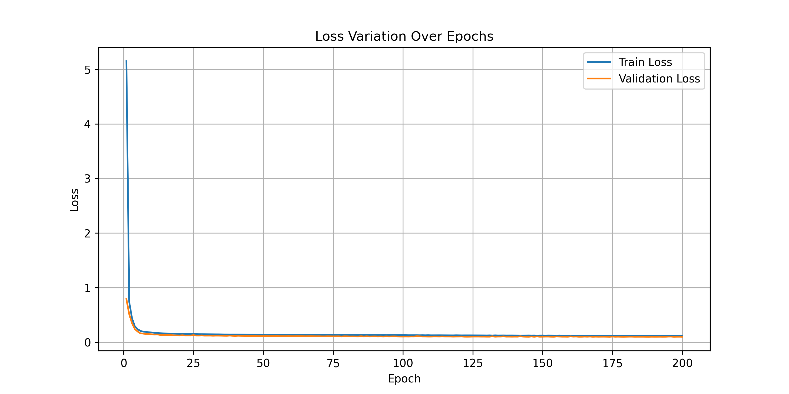
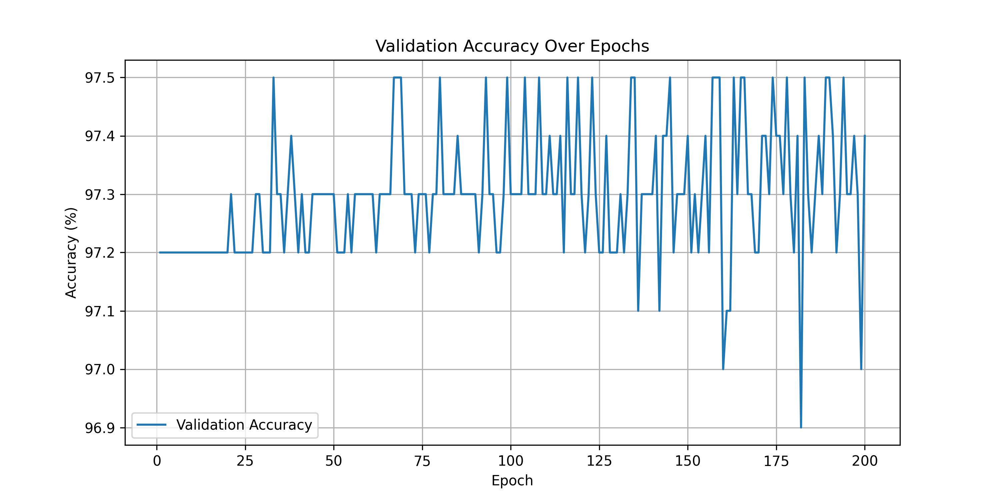

# Predictive Maintenance AI

## About the Project

This project implements an advanced machine learning solution for predictive maintenance using a Variational Autoencoder (VAE) with a classification layer. The primary goal is to predict and classify potential equipment failures in industrial settings by analyzing sensor data and machine characteristics.

The AI model learns complex representations of machine behavior, identifying potential failure modes before they occur, which can significantly reduce downtime and maintenance costs.

## Features

- **Advanced Machine Learning Architecture**:
  - Variational Autoencoder (VAE) for feature learning
  - Multi-class failure classification
  - Anomaly detection capabilities

- **Comprehensive Sensor Data Analysis**:
  - Processes multiple sensor inputs including:
    - Air temperature
    - Process temperature
    - Rotational speed
    - Torque
    - Tool wear

- **Intelligent Failure Prediction**:
  - Supports 6 different failure categories
  - High-accuracy classification model
  - Probabilistic prediction of failure types

- **Preprocessing and Scalability**:
  - Standard scaling of input features
  - Robust preprocessing techniques
  - Supports batch prediction

## Installation

### Prerequisites
- Python 3.8 or higher
- CUDA-compatible GPU (recommended, but optional)

### Step-by-Step Installation

1. Clone the repository
   ```bash
   git clone https://github.com/yourusername/predictive-maintenance-ai.git
   cd predictive-maintenance-ai
   ```

2. Create a virtual environment (recommended)
   ```bash
   python -m venv venv
   source venv/bin/activate  # On Windows use `venv\Scripts\activate`
   ```

3. Install dependencies
   ```bash
   pip install -r requirements.txt
   ```

### Requirements File (requirements.txt)
Create a `requirements.txt` file with the following contents:

```
torch>=1.10.0
numpy>=1.21.0
pandas>=1.3.0
scikit-learn>=0.24.0
matplotlib>=3.4.0
pickle5>=0.0.11
```

## Usage

### Prediction Example

```python
from predictive_maintenance import PredictiveMaintenance

# Initialize the predictive maintenance model
pm_model = PredictiveMaintenance()

# Predict for a single sample
single_sample_result = pm_model.predict_anomaly(sample_data)
print(single_sample_result)

# Predict for multiple samples
batch_results = pm_model.batch_predict(multiple_samples)
```

### Key Prediction Outputs
- `predicted_class`: Type of potential failure
- `probability`: Confidence of the prediction
- `reconstruction_error`: Anomaly score

## Testing

### Model Performance Evaluation

1. **Training Performance Metrics**:
   - Loss variation plot: `Results/loss_variation.png`
   
   - Validation accuracy plot: `Results/accuracy_variation.png`
   

2. **Test Script**
   Create a `test_predictive_maintenance.py` file to validate model predictions:

   ```python
   import unittest
   from predictive_maintenance import PredictiveMaintenance
   import pandas as pd

   class TestPredictiveMaintenance(unittest.TestCase):
       def setUp(self):
           self.pm_model = PredictiveMaintenance()
           self.test_data = pd.read_csv('Dataset/test_data.csv')

       def test_single_prediction(self):
           result = self.pm_model.predict_anomaly(self.test_data.iloc[0:1])
           self.assertIn('predicted_class', result)
           self.assertIn('probability', result)

       def test_batch_prediction(self):
           batch_results = self.pm_model.batch_predict(self.test_data)
           self.assertEqual(len(batch_results), len(self.test_data))

   if __name__ == '__main__':
       unittest.main()
   ```

## Contributing

Contributions are welcome! Please follow these steps:

1. Fork the repository
2. Create a new branch (`git checkout -b feature/AmazingFeature`)
3. Commit your changes (`git commit -m 'Add some AmazingFeature'`)
4. Push to the branch (`git push origin feature/AmazingFeature`)
5. Open a Pull Request

### Contribution Guidelines
- Follow PEP 8 style guidelines
- Add unit tests for new features
- Update documentation accordingly

## License
[Specify your license, e.g., MIT License]

## Contact
[Your Name] - [your.email@example.com]

Project Link: [https://github.com/yourusername/predictive-maintenance-ai](https://github.com/yourusername/predictive-maintenance-ai)
