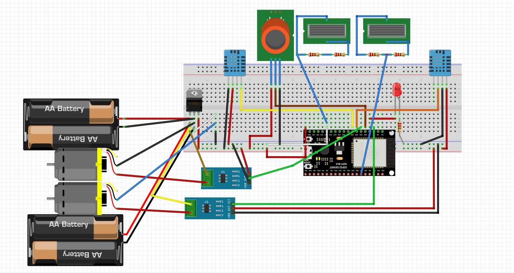

<a name="readme-top"></a>

<div align="center">

[![Contributors][contributors-shield]][contributors-url]
[![Forks][forks-shield]][forks-url]
[![Stargazers][stars-shield]][stars-url]
[![Issues][issues-shield]][issues-url]
[![MIT License][license-shield]][license-url]
[![LinkedIn][linkedin-shield]][linkedin-url]
</div>

---

# 🏭 Smart and Sustainable Industrial Zones (IAS)

**A comprehensive IoT and AI-powered system for modernizing Tunisia's industrial zones into intelligent, eco-friendly hubs.**
Built with ❤️ by IEEE SUP'COM Student Branch.

<br />
<div align="center">
  <a href="https://github.com/HabibBekir/TSYP12-IAS-challenge-IEEE-SUPCOM-SB">
     
  </a>
  <h3>Smart and Sustainable Industrial Zones</h3>
  <p align="center">
    <strong>Transforming Tunisia's industrial landscape through IoT, AI, and blockchain technology</strong>
    <br />
    <br />
    <a href="https://github.com/HabibBekir/TSYP12-IAS-challenge-IEEE-SUPCOM-SB/issues/new?labels=bug&template=bug-report---.md">Report Bug</a>
    ·
    <a href="https://github.com/HabibBekir/TSYP12-IAS-challenge-IEEE-SUPCOM-SB/issues/new?labels=enhancement&template=feature-request---.md">Request Feature</a>
      </p>
</div>

<br/>

---

<details>
  <summary>Table of Contents</summary>
  <ol>
    <li><a href="#about-the-project">About The Project</a></li>
    <li><a href="#-features">Features</a></li>
    <li><a href="#-system-design">System Design</a></li>
    <li><a href="#-technologies-used">Technologies Used</a></li>
    <li><a href="#-architecture-and-infrastructure">Architecture and Infrastructure</a></li>
    <li><a href="#-getting-started">Getting Started</a></li>
    <li><a href="#-project-components">Project Components</a></li>
    <li><a href="#-solution-demo">Solution Demo</a></li>
    <li><a href="#-contributing">Contributing</a></li>
    <li><a href="#-license">License</a></li>
     <li><a href="#-contact">Contact</a></li>
  </ol>
</details>

<div align="right">
  <a href="#readme-top">
    
  </a>
</div>

---

## About The Project

**🚀 Smart and Sustainable Industrial Zones (IAS)** is a transformative project aiming to modernize Tunisia's industrial zones into intelligent, eco-friendly hubs by 2056. This initiative integrates decentralized renewable energy systems, IoT sensors, AI-driven predictions, and blockchain technology for efficient energy management. The project also involves workforce training and collaboration with academic institutions to foster innovation and build capacity for a greener industrial ecosystem.

### 🎯 Key Features

- 🔧 **Real-Time Monitoring**: IoT sensors provide data on energy usage, emissions, temperature, and more, allowing for real-time decision-making
- 🤖 **AI-Powered Optimization**: Machine learning models predict future energy demands and enable predictive maintenance
- ⚡ **Blockchain Energy Trading**: Uses Hedera blockchain and Hbar Coin to tokenize renewable energy production for transparent trading
- 🌐 **Mobile Interface**: User-friendly React Native application with dashboards and real-time alerts
- 📝 **Predictive Maintenance**: AI forecasts maintenance needs, preventing breakdowns and minimizing downtime

<div align="right">
  <a href="#readme-top">
    
  </a>
</div>

---

## 💻 System Design

The Smart and Sustainable Industrial Zones are designed to implement smart, decentralized energy management systems across Tunisia's industrial zones. The system design includes:

- **AI Models**: Machine Learning models for energy consumption prediction, optimized resource allocation, and predictive maintenance
- **IoT Integration**: The zones are equipped with IoT sensors that provide real-time monitoring of energy consumption, emissions, temperature, humidity, and other key metrics
- **Blockchain for Energy Trading**: The project leverages blockchain technology for secure, transparent energy trading between industrial facilities
- **User Interface**: A user-friendly interface for stakeholders to interact with data, set parameters, and monitor system performance, including visual dashboards and customizable alerts

<p align="center">
  
</p>

<div align="right">
  <a href="#readme-top">
    
  </a>
</div>

---

## 🤖 Technologies Used

- **Renewable Energy Systems**: Solar panels to ensure the zones are powered sustainably
- **IoT Sensors**: Installed throughout the industrial zones to provide real-time data on energy consumption, emissions, and other metrics
  - **DHT11**: Temperature and humidity sensors
  - **MQ135**: Gas sensor
  - **ACS712**: Current sensor for energy consumption tracking
- **AI and Machine Learning**: Used to predict energy demand, optimize resource usage, and reduce downtime through predictive maintenance
  - **PyTorch**: For Variational Autoencoder (VAE) implementation
  - **TensorFlow**: For GRU-based energy prediction models
- **Blockchain Tokenization**: Each factory's renewable energy production is tokenized using Hbar Coin on the Hedera blockchain
- **5G Network**: Enables real-time communication between all connected devices and systems
- **Mobile Development**: React Native for cross-platform mobile application
- **Backend Technologies**: Python with Firebase integration for data management

<div align="right">
  <a href="#readme-top">
    
  </a>
</div>

---

## 🏗️ Architecture and Infrastructure

The architecture of the Smart and Sustainable Industrial Zones is modular and scalable, allowing for gradual implementation across different zones. Key components include:

- **Frontend**: A user-friendly interface built using React Native, where stakeholders can view key metrics, set alerts, and interact with the system
- **Backend**: A server that processes data from IoT devices, manages energy data storage in Firestore, and integrates with the AI models
- **Blockchain Network**: A tokenization system on the Hedera blockchain that enables renewable energy production to be represented as tradable tokens, fostering an interconnected energy marketplace
- **AI Models Server**: A dedicated server running the AI models used for energy prediction and optimization


<div align="right">
  <a href="#readme-top">
    
  </a>
</div>

---

## ⚡ Getting Started

### Prerequisites

The project consists of multiple components with different prerequisites:

- **For AI Models**: Python 3.8+, PyTorch, TensorFlow
- **For Mobile App**: Node.js, React Native development environment
- **For Blockchain**: Node.js, Hedera Testnet account
- **For IoT**: Arduino IDE, ESP32 development board
- **For Backend**: Python, Firebase account

### Installation

```bash
# Step 1: Clone the repository
git clone https://github.com/HabibBekir/TSYP12-IAS-challenge-IEEE-SUPCOM-SB.git

# Step 2: Navigate to the project directory
cd TSYP12-IAS-challenge-IEEE-SUPCOM-SB

# Step 3: Follow individual component setup instructions (see Project Components section)
```

<div align="right">
  <a href="#readme-top">
    
  </a>
</div>

---

## 📚 Project Components

This repository contains several interconnected components:

| Component | Description | Technology Stack |
|-----------|-------------|------------------|
| **AI Models** | Machine learning models for predictive maintenance and energy forecasting | Python, PyTorch, TensorFlow |
| **Mobile App** | Cross-platform monitoring and control interface | React Native, JavaScript |
| **Blockchain** | Renewable energy tokenization system | Node.js, Hedera Hashgraph |
| **IoT Backend** | ESP32 to Firebase data pipeline | Python, Firebase |
| **ESP32 Code** | Sensor data collection and transmission | Arduino, C++ |

### AI Models

#### Machine Maintenance Prediction Model
- **Technology**: Variational Autoencoder (VAE) with classification layer
- **Purpose**: Predict and classify potential equipment failures
- **Features**: Anomaly detection, multi-class failure classification
- **Location**: `AI Models/Machine Maintenance Prediction Model/`

#### Energy Demand Model
- **Technology**: GRU (Gated Recurrent Unit) neural networks
- **Purpose**: Predict electricity consumption in industrial settings
- **Features**: Time series forecasting, energy optimization
- **Location**: `AI Models/Energy demand Model/`

### Mobile Application
- **Technology**: React Native
- **Features**: Real-time monitoring, alerts, energy insights
- **Location**: `TSYP12_SUPCOM_Mobile_App/`

### Blockchain System
- **Technology**: Hedera Hashgraph, ECoin tokens
- **Features**: Energy tokenization, transparent trading
- **Location**: `blockchain/files/`

### IoT Integration
- **Hardware**: ESP32, DHT11, MQ135, ACS712 sensors
- **Backend**: Python server with Firebase integration
- **Locations**: `IAS_ESP32_Code/`, `IAS_Backend_ESP_TO_FireBase/`

<div align="right">
  <a href="#readme-top">
    
  </a>
</div>

---

## 🎥 Solution Demo

<div align="center">
  
   [](https://drive.google.com/drive/folders/1MNMinBLUF688kiSodCmZa87QL2LmlKw0)
  <br/>
  Watch our complete solution demonstration showcasing:
  - 🛡️ Real-time threat detection
  - 🤖 AI-driven analysis
  - 🔄 Automated response system
  - 📊 Live dashboard monitoring

  <i>Click the button above to view the full demonstration</i>
</div>

<div align="right">
  <a href="#readme-top">
    
  </a>
</div>

---

## 🤝 Contributing

Contributions are what make the open source community amazing! Any contributions are **greatly appreciated**.

### How to Contribute

1. **Fork the Project**
2. **Create your Feature Branch** (`git checkout -b feature/AmazingFeature`)
3. **Commit your Changes** (`git commit -m 'Add some AmazingFeature'`)
4. **Push to the Branch** (`git push origin feature/AmazingFeature`)
5. **Open a Pull Request**

<div align="right">
  <a href="#readme-top">
    
  </a>
</div>

---

## 📃 License

Distributed under the MIT License. See `LICENSE` for more information.

<div align="right">
  <a href="#readme-top">
    
  </a>
</div>

---

## 📧 Contact

**IEEE SUP'COM Student Branch** - [IEEE SUP'COM SB LinkedIn](https://www.linkedin.com/in/chater-marzougui-342125299/)

Project Link: [https://github.com/HabibBekir/TSYP12-IAS-challenge-IEEE-SUPCOM-SB](https://github.com/HabibBekir/TSYP12-IAS-challenge-IEEE-SUPCOM-SB)

---

## 🙏 Acknowledgments

- IEEE SUP'COM Student Branch for project leadership and coordination
- TSYP12 Challenge organizers for providing the platform for innovation
- All contributors and team members who made this project possible
- Academic institutions and industry partners for their collaboration and support

<div align="right">
  <a href="#readme-top">
    
  </a>
</div>

---

**The Smart and Sustainable Industrial Zones project aims to bring about a significant shift in how industrial energy management is approached in Tunisia, creating a model for sustainable, efficient, and eco-friendly industry practices.**

[contributors-shield]: https://img.shields.io/github/contributors/HabibBekir/TSYP12-IAS-challenge-IEEE-SUPCOM-SB.svg?style=for-the-badge
[contributors-url]: https://github.com/HabibBekir/TSYP12-IAS-challenge-IEEE-SUPCOM-SB/graphs/contributors
[forks-shield]: https://img.shields.io/github/forks/HabibBekir/TSYP12-IAS-challenge-IEEE-SUPCOM-SB.svg?style=for-the-badge
[forks-url]: https://github.com/HabibBekir/TSYP12-IAS-challenge-IEEE-SUPCOM-SB/network/members
[stars-shield]: https://img.shields.io/github/stars/HabibBekir/TSYP12-IAS-challenge-IEEE-SUPCOM-SB.svg?style=for-the-badge
[stars-url]: https://github.com/HabibBekir/TSYP12-IAS-challenge-IEEE-SUPCOM-SB/stargazers
[issues-shield]: https://img.shields.io/github/issues/HabibBekir/TSYP12-IAS-challenge-IEEE-SUPCOM-SB.svg?style=for-the-badge
[issues-url]: https://github.com/HabibBekir/TSYP12-IAS-challenge-IEEE-SUPCOM-SB/issues
[license-shield]: https://img.shields.io/github/license/HabibBekir/TSYP12-IAS-challenge-IEEE-SUPCOM-SB.svg?style=for-the-badge
[license-url]: https://github.com/HabibBekir/TSYP12-IAS-challenge-IEEE-SUPCOM-SB/blob/master/LICENSE.txt
[linkedin-shield]: https://img.shields.io/badge/-LinkedIn-black.svg?style=for-the-badge&logo=linkedin&colorB=555
[linkedin-url]: https://www.linkedin.com/in/chater-marzougui-342125299/